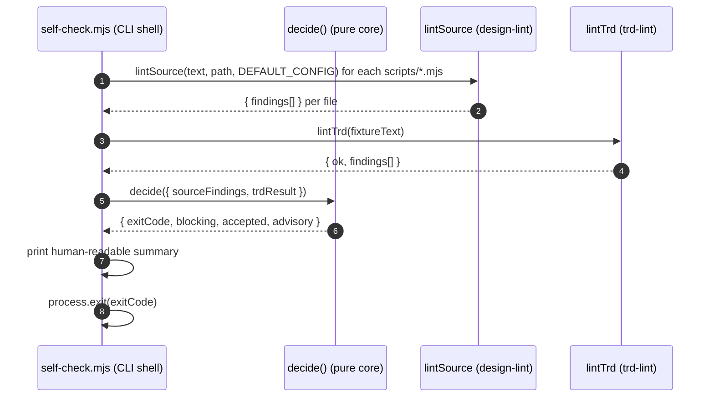

The objective of this TRD is to provide a concise and complete technical design for the eng-org plugin's self-check CLI that dogfoods its own linters.

## 1. What Are We Doing?

Adding a single stdlib-only self-check entry point (`scripts/self-check.mjs`) to the eng-org plugin that runs the plugin's own linters (`lintTrd`, `lintSource`) against its own source tree and a canonical passing TRD fixture.

- Problem statement: the plugin ships several mechanical linters but has no first-party dogfooding gate that proves the plugin's own scripts pass its own rules. A developer adding a new script has no automated signal that the new file violates the plugin's own standards.
- Scope: one new executable `.mjs` file, one co-located test suite, one TRD fixture, and 7 TECH_DEBT entries for pre-existing function-length findings.
- Non-scope: CI wiring, changes to existing `.mjs` scripts, refactoring over-long functions (deferred to TECH_DEBT, per G-10).
- Link to requirement: REQ-20260718-d904-09, AC-6.

## 2. How Are We Doing It?

The self-check imports the plugin's real pure-core exports (`lintTrd` from `trd-lint.mjs`; `lintSource`, `DEFAULT_CONFIG` from `design-lint.mjs`) and uses `node:fs` `readdirSync` to enumerate `scripts/*.mjs` targets. All paths are resolved via `fileURLToPath(import.meta.url)` and `node:path` — no machine-absolute literals.

**End-to-end implementation flow:**

**Exit decision (pure `decide` function):**
- Advisory findings (`severity === 'advisory'`) are printed but never block exit.
- Error findings (`severity === 'error'`) are candidate-blocking; `ACCEPTED_FINDINGS` entries are subtracted before the exit decision.
- `lintTrd` failure (fixture not ok) is always blocking; no allowlist for TRD.
- Exit 0 iff no un-allowlisted error findings AND `lintTrd.ok === true`.
- Exit 2 on any IO/import failure (fail-closed, `e.code`-discriminated).

**The `ACCEPTED_FINDINGS` two-tier allowlist:**
- Tier 1 (10 entries): self-referential findings where the linter's own source necessarily contains the pattern it detects, plus spec-permitted long files. Match key: `basename(path) + smell`.
- Tier 2 (7 entries): pre-existing over-long functions backed by `governance/TECH_DEBT.md` entries (TD-2026-07-18-01 through TD-2026-07-18-07). Match key: `basename(path) + smell + line` (start line of the function, as emitted in `finding.line`). Per-site keying ensures a NEW over-long function in the same file still trips red.

**Why this approach over alternatives:**
- Alternative A: spawn the CLI scripts via `spawnSync`. Rejected — spawning processes is fragile, slower, and violates MISTAKES gr-P1-#2 (always import real exports).
- Alternative B: re-implement the severity logic inline. Rejected — imports `DEFAULT_CONFIG` from the real module to stay DRY (MISTAKES 2026-07-15 inline-not-import).
- Alternative C: point `lintTrd` at `templates/trd.template.md`. Rejected — the template is a frozen human-approved artifact; coupling the self-check's pass/fail to it would make the self-check brittle when the template evolves. A dedicated fixture is the canonical test-fixture pattern.

**Error handling:**
- `readFileSync` failures → catch, discriminate on `e.code`, print named error, exit 2.
- Import failures of pure cores → caught at module load time; discriminated on `e.code`, exit 2.

**Idempotency considerations:**
The self-check is a read-only inspection tool. It writes nothing. Every run on the same source tree produces the same exit code. Fully idempotent.

**Retry mechanisms:**
Not applicable. This is a dev-time CLI tool, not an async job.

**Async processing:**
Not applicable. All file reads are synchronous (`readFileSync`); pure cores are synchronous functions. No `async`/`await` needed.

**Performance implications:**
Linear in the number of `.mjs` files (currently ~25 files). Each `lintSource` call is O(lines). Total runtime is well under 1 second on a developer workstation.

**Data consistency considerations:**
Not applicable. No writes, no DB, no shared state.

## 3. DB Schema (include ONLY when DB changes)

N/A — no DB changes in this REQ.

## 4. API Contracts

N/A — no API contract changes in this REQ.

## 5. Acceptance Criteria

The self-check satisfies AC-6 from REQ-20260718-d904-09:

- [x] AC-6.1 self-check CLI exists, single-command runnable: `node scripts/self-check.mjs` from the plugin root.
- [x] AC-6.2 `node:*` only, zero npm deps, mirrors sibling CLI shape (exit 0/1/2 contract).
- [x] AC-6.3 runs `lintTrd` against the dedicated fixture resolved via `import.meta.url`.
- [x] AC-6.4 runs `lintSource` against `scripts/*.mjs` (enumerated via `readdirSync`).
- [x] AC-6.5 exit 0 on clean/allowlist-only; non-zero on un-allowlisted blocking finding.
- [x] AC-6.6 `ACCEPTED_FINDINGS` explicit, greppable, per-entry `reason`, includes `(verdict-lint.mjs, file-length)`; NOT a blanket ignore.
- [x] AC-6.7 no machine-absolute path in any of the 3 new files (`grep` zero hits).
- [x] AC-6.8 co-located `*.test.mjs` covers green path, allowlist subtraction, and the non-allowlisted → non-zero counter-test.
- [x] TECH_DEBT entries created for the 7 pre-existing function-length findings (TD-2026-07-18-01 through -07).

---

## eng-org extensions

*The sections below are additive eng-org tooling requirements. They sit AFTER the Ratio core (above) and are clearly separated by this divider. Do NOT reorder or merge them with §1–§5.*

## E1. Design Principles Applied

- **SRP:** `decide()` is a pure function with a single responsibility: take findings, return an exit decision. All IO stays in the thin CLI shell.
- **DRY:** `DEFAULT_CONFIG` is imported from `design-lint.mjs`; thresholds are never duplicated.
- **YAGNI:** no CI wiring added; no external config file; no pluggable allowlist format — deferred until a real need arises.
- **Boy-Scout-not-Demolition:** the pre-existing over-long functions in `invalidation.mjs`, `output-cap.mjs`, and `verdict-lint.mjs` are NOT refactored — they are logged to `governance/TECH_DEBT.md` with retirement dates and left untouched (G-10).
- **Fail-closed:** IO errors exit 2 with a named error code; no silent PASS on a read failure.
- **Trade-off:** per-site keying (path+smell+line) for tier-2 entries adds a coupling to the current line numbers of the pre-existing functions. If those functions are ever refactored (as planned in the TECH_DEBT entries), the line numbers will change and the tier-2 entries will become stale — but at that point the functions will no longer be over-long, so the findings will not exist and the entries will be effectively dead (harmless). The correct fix at refactor time is to DELETE the corresponding tier-2 entries and their TECH_DEBT rows.

## E2. Blast Radius & Change Budget

**Change budget:**
files_touched_max: 4
loc_max: 500
allow_full_rewrite: false

**Blast radius narrative:**
This REQ adds 3 net-new files and appends 7 rows to a governance doc. Nothing is imported from the self-check by any other script or agent. No existing `.mjs` is modified. Zero blast radius on the published plugin behaviour or any CI pipeline (no CI wiring in scope). Fully reversible: delete the 3 new files and revert the TECH_DEBT.md append.

**Rollback plan:**
1. Delete `scripts/self-check.mjs`.
2. Delete `scripts/self-check.test.mjs`.
3. Delete `scripts/fixtures/self-check-sample-trd.md`.
4. Revert the 7 appended rows in `governance/TECH_DEBT.md` (TD-2026-07-18-01 through -07).
5. No migration, no cache invalidation, no consumer update required.

## E3. File-by-File Change Map

| File | State | Intent |
|---|---|---|
| `scripts/self-check.mjs` | net-new | Self-check entry point: imports pure cores, enumerates scripts, calls `decide()`, exits 0/1/2 |
| `scripts/self-check.test.mjs` | net-new | Co-located node:test suite: 11 test cases covering green path, allowlist, counter-tests, IO fail-closed |
| `scripts/fixtures/self-check-sample-trd.md` | net-new | Canonical passing TRD fixture used by the self-check and test #5 |
| `governance/TECH_DEBT.md` | append-only | +7 rows for pre-existing function-length findings (TD-2026-07-18-01 through -07) |

## E4. Test-Tier Strategy

**Unit (co-located `self-check.test.mjs`, node:test):**
- [x] #1 Green path: `decide()` with only allowlisted errors + advisories + clean TRD → exit 0.
- [x] #2 Allowlist subtraction: `verdict-lint.mjs` file-length present in raw set AND removed by allowlist.
- [x] #3 Non-allowlisted error → non-zero (anti-always-PASS counter-test, L-2).
- [x] #4 Advisory-only (`duplicate-block`) → exit 0.
- [x] #5 Fixture lints clean: `lintTrd(readFixture()).ok === true`.
- [x] #6 Broken TRD (missing §5) → non-zero.
- [x] #7 Every ACCEPTED_FINDINGS entry has a non-empty `reason`.
- [x] #8 IO fail-closed: missing path → non-zero, error surfaced.
- [x] #9 No machine-absolute path in source.
- [x] #10 Per-site keying: `buildDependencyGraph` finding is absorbed; `newlyAddedHugeFn` finding is not.
- [x] #11 Every tier-2 entry carries a `techDebt` id.

**Integration:**
- SKIP-WITH-NOTE: the live-tree check (`node scripts/self-check.mjs`) is not a test-suite test; it is the self-check evidence step run by the Dev and pasted into `TASK-1-diff.md`. It must exit 0 per A-19.

**E2E / contract:**
- SKIP-WITH-NOTE: no external consumers; no API contract to verify.

**Performance:**
- SKIP-WITH-NOTE: linear file reads, well under 1s; no hot path; no index; no DB query.

**Coverage gate:**
- Target: ≥ 95% branch coverage on `self-check.mjs` net-new code (per COVERAGE_THRESHOLDS.md).
- The `decide()` pure function covers all meaningful branches via tests #1–#6 and #10.
- The IO shell's error-path branches are covered by test #8.
