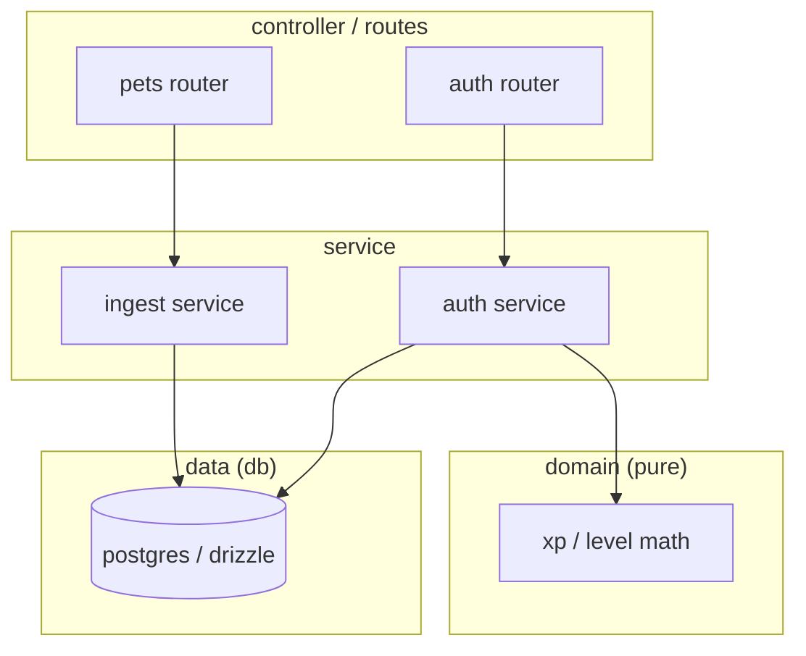
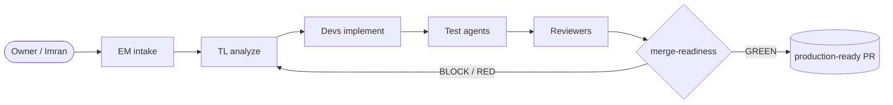

# graphyfy — draw the project's linking so an AI can understand it cold

You were invoked to **graphyfy** the current project: produce a small set of
Mermaid diagrams that make the project's *linking* (how parts connect) visible
at a glance. A fresh AI or engineer should be able to open these graphs and
understand the relationships without reading every file.

The output is plain Markdown with fenced ```mermaid``` blocks — no external
tools, no rendering step. It renders in GitHub, VS Code, and most viewers, and
LLMs read Mermaid natively.

## Core rule — idempotent create-or-update

Every graph file carries a generated marker on its first content line:

```
<!-- eng-org:graphyfy generated YYYY-MM-DD — DO NOT hand-edit the mermaid blocks; rerun /eng-org:graphyfy -->
```

For **each** target file below:

1. Check if it already exists (Glob / `test -f`).
2. **If it exists** → `Read` it, regenerate the diagram(s) from current project
   state, and use `Edit` to replace ONLY the fenced ```mermaid``` block(s) and
   refresh the date in the marker. Preserve any prose the user added outside the
   fenced blocks. Never blow the file away.
3. **If it does not exist** → `Write` it fresh from the structure below.

Never delete a graph file. If a source (e.g. a REQ) disappeared, regenerate
without its node rather than leaving the file stale.

## Where graphs live

All graphs go in `governance/graphs/`. Create the directory if absent.

```
governance/graphs/
  README.md         ← index: links every graph + a one-line "what it shows"
  architecture.md   ← module / layer dependency linking
  domains.md        ← domain ownership + data-model relationships
  requirements.md   ← REQ → task dependency DAG (depends_on edges)
  pipeline.md       ← the role pipeline (EM → TL → Dev → Test → Review)
```

## Steps

### 0. Confirm you are at a project root
An `eng-org.json` or `governance/` must exist. If neither does, tell the user to
run `/eng-org:init` first and stop. Stay inside the cwd — never read/write outside it.

Get today's date: `date +%Y-%m-%d`. Use it in every marker.

### 1. Read the sources (no guessing — read, don't recall)
- `eng-org.json` — stack, `domains[]` (id + owns), governance paths.
- `governance/ARCHITECTURE.md` and `governance/MODULE_REGISTRY.md` (if present) —
  layers and module ownership.
- The real code roots from `eng-org.json` / detection (e.g. `backend/src/`,
  `mobile/app/`) — Grep `import` statements only as far as needed to confirm
  cross-module edges. Do not exhaustively parse; capture the *shape*, not every line.
- `governance/requirements/REQ-*/` — each `spec.md` (for the REQ node) and each
  `tasks/TASK-*.md` frontmatter (`depends_on:`, `status:`) for edges.
- Schema files if a data layer exists (e.g. Drizzle/Prisma schema) — capture
  entity relationships (FKs, M:N join tables).

### 2. Build `architecture.md` — module/layer linking
A `flowchart` showing the layers and which module depends on which. Group by
layer using subgraphs. Direction top-down. Example shape:

````markdown
<!-- eng-org:graphyfy generated {{DATE}} — DO NOT hand-edit the mermaid blocks; rerun /eng-org:graphyfy -->
# Architecture linking

How the modules/layers depend on each other. Arrows point from caller → callee.


````

Only draw edges you actually found. If layering can't be determined, draw
top-level folders as nodes and their import edges instead.

### 3. Build `domains.md` — domain ownership + data model
Two diagrams: (a) each domain from `eng-org.json` and the files/areas it owns;
(b) an `erDiagram` of the core entities and their relationships (use the project's
real cardinalities — e.g. read them from the schema; do not assume 1:1 where a
join table indicates M:N). If there is no data layer, emit only (a).

### 4. Build `requirements.md` — REQ → task dependency DAG
A `flowchart LR`. One node per REQ (label `REQ-<id>`), one node per task. Edge
REQ → its tasks; edge `TASK-m --> TASK-n` for every `depends_on: TASK-m` on
TASK-n. Style nodes by `status` (done vs in-progress vs blocked) using Mermaid
`classDef`. Keep it to the REQs that still have task files — skip archived ones.
If there are no requirements yet, write the file with an empty-state note and a
placeholder diagram so the next run just updates it.

### 5. Build `pipeline.md` — the role pipeline
A static `flowchart LR` of the eng-org flow (this rarely changes, but include it
so a cold reader sees the process):



### 6. Build `README.md` — the graph index
Link each graph with a one-line "what it shows", plus the generated date. This is
the file AGENTS.md points cold-pickup readers at.

### 7. Report
Print which files were **created** vs **updated**, and the node/edge counts per
graph (e.g. "requirements.md: 12 REQs, 34 tasks, 9 dependency edges"). Tell the
user the graphs live in `governance/graphs/` and are referenced from `AGENTS.md`.

## What you do NOT do
- Do not write or edit application code. This skill only reads code and writes
  into `governance/graphs/`.
- Do not invent nodes/edges. Every node and edge must trace to something you read.
- Do not render to images or call external services — Mermaid text only.
- Do not overwrite prose a user added outside the fenced mermaid blocks.
- Do not reach outside the current working directory.
