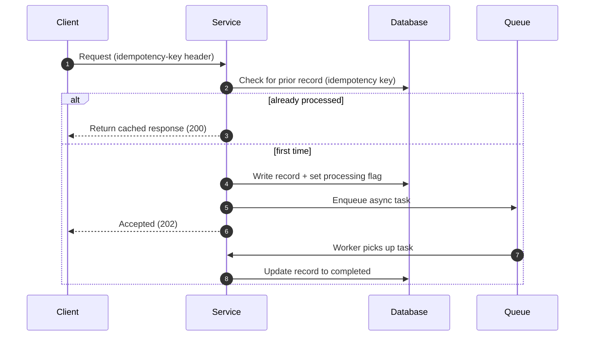

The objective of this TRD is to provide a concise and complete technical design that can be reviewed, discussed, and implemented without ambiguity.

## 1. What Are We Doing?

[Brief description of the feature or change. Cover:]

- Problem statement: what problem does this solve, and why now?
- Scope: what IS included in this change.
- Non-scope: what is explicitly NOT included.
- Link to PRD or requirement: [link here]

## 2. How Are We Doing It?

[Concise implementation approach. MUST cover ALL of the following:]

**End-to-end implementation flow:**

**Idempotency considerations:**
[How is the operation made idempotent? What key identifies a duplicate? What is returned on a duplicate call?]

**Retry mechanisms:**
[Retries at which layer? Max attempts? Backoff strategy? What is retried vs. not?]

**Async processing:**
[Which parts are async? How is the caller notified? How is partial completion handled?]

**Error handling & failure scenarios:**
[List failure modes and how each is handled — network errors, DB timeouts, downstream failures, invalid input.]

**Data consistency considerations:**
[Transactions? Eventual consistency? Compensating transactions if partial failure?]

**Performance implications:**
[Expected latency, throughput, DB query complexity, index usage. Any N+1 risks?]

**Why this approach over alternatives:**
[At least two alternatives considered and why this approach was chosen.]

A reviewer must understand: (1) What happens? (2) Why it happens? (3) What happens when it fails?

## 3. DB Schema (include ONLY when DB changes)

N/A — no DB changes in this REQ.

## 4. API Contracts

N/A — no API contract changes in this REQ.

## 5. Acceptance Criteria

[Clear measurable outcomes. Cover:]

- [ ] Functional requirements validated: [list each]
- [ ] Idempotency guarantees verified: duplicate requests return the same result without side effects
- [ ] Retry mechanisms validated: failed jobs are retried up to N times with backoff
- [ ] Monitoring/alerting added where required: [metrics, alerts, dashboards]
- [ ] No unintended breaking changes: existing callers unaffected

---

**Review Process:**
Step 1 — Author creates TRD → Step 2 — Author walkthrough → Step 3 — Review → Step 4 — TRD updates.

**Guiding Principle:** If a design decision is important enough to be discussed during review, it is important enough to be documented in the TRD.

---

## eng-org extensions

*The sections below are additive eng-org tooling requirements. They sit AFTER the Ratio core (above) and are clearly separated by this divider. Do NOT reorder or merge them with §1–§5.*

## E1. Design Principles Applied

[Which principles from SOLID / DRY / KISS / YAGNI / Law of Demeter / Boy-Scout-not-Demolition apply to the changed code, and what TRADE-OFF was made?]

**Example:**
- **SRP:** the new handler class has one reason to change — processing the webhook payload.
- **DRY:** shared validation extracted to `validatePayload()` rather than duplicated across two controllers.
- **YAGNI:** caching layer deferred — current load does not warrant it; placeholder hook added.
- **Trade-off:** SRP vs. performance — one extra function call per request; acceptable given p99 < 50 ms.
- **Boy-Scout-not-Demolition:** touched files are cleaner than found; no unrelated refactors pulled in.

## E2. Blast Radius & Change Budget

[Anti-rewrite guard. Fill in the budget fields below as plain `key: value` lines. These are machine-parsed by REQ-M3-1 scope-explosion-guard.]

**Change budget:**
files_touched_max: 5
loc_max: 300
allow_full_rewrite: false

**Blast radius narrative:**
[Which services / modules / consumers are affected? What is the worst-case impact if this change ships broken? Is this change reversible without a migration?]

**Rollback plan:**
[Step-by-step: how do we roll back if the change causes an incident in production?]

## E3. File-by-File Change Map

[Every file touched, its state (net-new / modified / deleted), and a one-line intent.]

| File | State | Intent |
|---|---|---|
| `src/[module]/[file].ts` | modified | Add `idempotencyKey` field to the request DTO |
| `src/[module]/[handler].ts` | net-new | New webhook handler implementing the async flow |
| `src/[module]/[schema].sql` | net-new | Migration: add `processing_flag` column to `jobs` table |
| `src/[module]/[handler].test.ts` | net-new | Unit tests for the new handler — happy path + failure modes |

## E4. Test-Tier Strategy

[Test tiers beyond the acceptance criteria in §5. Justify any SKIP-WITH-NOTE.]

**Unit:**
- [ ] Happy path: [describe]
- [ ] Failure modes: [list each failure scenario from §2]
- [ ] Idempotency: duplicate key → same output, no side effect

**Integration:**
- [ ] End-to-end through service layer with real DB (test DB, not production)
- [ ] Queue consumer processes task and updates DB correctly

**E2E / contract:**
- [ ] SKIP-WITH-NOTE: [if skipping, state the reason and who owns the gap]

**Performance:**
- [ ] SKIP-WITH-NOTE: [if skipping, state why — e.g. "no new DB query; existing index covers the lookup"]

**Coverage gate:**
- Target: ≥ 95% branch coverage on net-new code (per COVERAGE_THRESHOLDS.md)
- Unreachable defensive branches (e.g. exhaustive-match fallback): SKIP-WITH-NOTE "defensive unreachable branch per exhaustive union — not a real gap"
